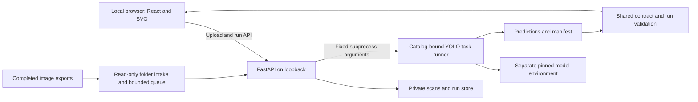

# GUI architecture and stack decision

Decision date: 25 September 2026. Task: [T28](https://github.com/abdalrahman-ismaik/SDP-I-RayGuard/blob/main/docs/tasks.md).

26 September follow-up: [portable runtime setup](runtime-verification.md) now
implements reviewed Windows x64 CPU/NVIDIA profiles, hardware discovery and isolated
first-run preparation. Managed configurations use Auto with verified CPU fallback;
explicit overrides remain. Real CPU/CUDA parity, app execution and rollback passed
on the local RTX 2060. Additional laptops and CPU hosts remain unverified.

## Repository boundary after extraction — 27 September 2026

This repository owns `frontend/`, `backend/`, the launcher, configuration
example, app tests and documentation. `engine/` is the pinned Git submodule
of SDP-I-RayGuard; it owns contracts, the model catalog, runner scripts and
reviewed model-environment locks. The backend dependency resolves to that
checkout. Runtime fingerprints include both engine and app adapter sources.
A changed checkout needs its own model qualification; historical SDP runs
are not a qualification of this extracted app. Data, weights, environments
and machine-local configs remain outside published source.

The original decisions below retain their dates. Research requirements and
the team backlog remain in SDP; see [current app setup](../README.md). The app
maintainer is identified in [CREDITS.md](../CREDITS.md); formal team assignments
and human showcase acceptance remain separate from repository maintenance.

## Requirement and selected boundary

**Recorded requirement:** M02 D7/A12/A15 and F02-4 call for a simple laptop GUI
and live existing-model showcase, ASAP for SLG. The exact lab laptop/pager pairing,
showcase date and human GUI/model owners remain unconfirmed. Full P1/P2 and the
proposal's broader scanner-control requirements are retained separately.

**Project decision:** a local React/TypeScript interface, a small FastAPI service,
and the catalog-bound YOLOv10 task runner in its own Python environment.
This draft makes that known baseline inspectable while leaving the model boundary
explicit. It does not rename generic explosive detections as device diagnoses.

## Options researched

| Option | What it gives us | Decision |
|---|---|---|
| React + TypeScript + Vite / FastAPI | Fine control over the canvas, linked findings, themes and accessibility; Python model isolation; static production frontend | Selected. Two build toolchains are acceptable; menu/workspace hash navigation needs no router package, SSR or database |
| PySide6 / QML | Native desktop canvas, controls and animation | Viable if a desktop executable becomes required; QML and Qt/Nuitka packaging add work now |
| NiceGUI | Quick Python-first UI, Quasar components and FastAPI foundation | Strong alternative for a short demo; custom inspection interactions would still require frontend work |
| Streamlit | Fast experimental model panels and data display | Less suitable for persistent canvas interaction; rerun/session-state design adds friction |
| Tauri / Electron | Desktop wrapper and native packaging | Deferred. Wrapping the interface does not improve the current model or showcase evidence |

Primary documentation inspected: [React from scratch](https://react.dev/learn/build-a-react-app-from-scratch),
[Vite](https://vite.dev/guide/), [FastAPI frontend hosting](https://fastapi.tiangolo.com/tutorial/frontend/),
[FastAPI concurrency](https://fastapi.tiangolo.com/async/),
[Qt Quick](https://doc.qt.io/qtforpython-6/PySide6/QtQuick/index.html),
[Qt deployment](https://doc.qt.io/qtforpython-6/deployment/deployment-pyside6-deploy.html),
[NiceGUI](https://nicegui.io/documentation/section_foundations),
[Streamlit fragments](https://docs.streamlit.io/develop/concepts/architecture/fragments),
[Tauri sidecars](https://v2.tauri.app/develop/sidecar/),
[Electron processes](https://www.electronjs.org/docs/latest/tutorial/process-model).
Framework suitability is our assessment, not a published benchmark.

## Design research

[Fluent 2](https://fluent2.microsoft.design/color) provides readable neutral surfaces
and semantic colors supported by text. [Carbon](https://carbondesignsystem.com/elements/color/overview/)
provides consistent layer relationships across light/dark themes. We use their
principles, not an entire component library: locally served IBM Plex Sans, restrained
blue controls, amber labeled detection boxes, and a dominant dark image canvas.
See [DESIGN.md](DESIGN.md) and [PRODUCT.md](PRODUCT.md).

The subsequent [visual comparison](visual-research.md) considered Carbon, Fluent
and Atlassian guidance, plus Plex, Inter and Source Sans 3. The chosen type scale,
matching light/graphite layers and progressive disclosure refine the existing
components. Subsequent user feedback simplified the layout to Choose/Run/Review:
one action strip, a dominant image and conditional findings, with settings,
history and technical details closed by default. Active intake and recovery stay
visible. Three official WOFF2 files and their OFL license
are bundled without adding runtime packages or an external font service.

The user's subsequent airport-interface request adds completed-export intake and
operator review. The scanner/interface remains unconfirmed. [Primary-source
research](scanner-research.md) informed the scan-dominant layout, bottom tools,
queue, history and alerts. This is a project implementation choice, not a claim
of commercial scanner compatibility or a new advisor acceptance requirement.

## Selected Analyst Studio layout — 26 September

The user selected layout 15 and then requested different fonts/themes. The working
app now keeps inspection mounted while switching Inspect, Session and Source.
App owns panel visibility, inspector width and per-scan display settings;
ScanCanvas retains the shared image/box transform. ViewAdjustments changes
display filters only. FindingsPanel keeps Review mounted across evidence tabs;
SessionHistory filters/sorts records without changing the selection;
Filmstrip selects actual saved runs. Appearance is a small local-preference
component, with independent semantic palettes and licensed bundled fonts. This
supersedes the earlier collapsed-control layout; it does not change the API/model
contract or add hardware connectivity.

The subsequent premium-console treatment changes presentation only: compact source
actions, a shallow filmstrip, quieter decorative separators and Onyx/Barlow defaults.
Input boundaries retain a separate contrast token. Local font assets include their
upstream licenses and hashes. Appearance uses a new browser-storage key so the
rejected initial choices do not override the new default; the old key is preserved.

## Continuous dashboard — 26 September follow-up

The user's Liquid Glass planner reference now supplies the shared dashboard shell:
current inspection and real source state, recent records and grouped workflow actions.
Five fixed hash routes need no router dependency or server fallback change. Native
anchors retain modifier/new-tab behavior, Back/Forward and direct entry. A labelled
sidebar can collapse; mobile Menu owns its disclosure/focus behavior. Existing scan
components remain mounted. No new backend capability, accounts or acquisition job.

## Modules and responsibilities

- `MainMenu.tsx`, `main-menu.css`, `workspaceSetup.ts`: workflow/setup form and
  typed browser-only configuration. App applies mode, visible panels, future-run
  threshold and follow preference after rechecking current readiness. Applying
  setup sends no API mutations. Folder receipt is an explicit view mode; paused
  replay keeps its captured resume threshold separate from a future-run setting.
- `Dashboard.tsx` and `dashboard.css`: actual current scan, valid-result review counts,
  source readiness, recent runs and workflow actions. No synthetic operational metrics.
- `DashboardNavigation.tsx`, `dashboard-navigation.css`, `pages.ts`: accessible
  sidebar/mobile disclosure and five hash routes. `dashboard-shell.css` shares the
  Liquid Glass tokens/layout; Instrument Serif assets are local with license/hashes.
- `App.tsx`: dashboard/setup/inspection/session/source navigation and shared header. The
  workspace stays mounted while hidden to retain zoom, filters and unsaved review;
  Return only navigates. Polling continues and activity/errors remain discoverable on other pages,
  with source/threshold edits locked. No pause/start is implied by navigation.
- `../run-app.ps1`: Windows setup/build/start entry point, automatic local config,
  existing-session detection and clear startup errors. The API remains a foreground process.
- `frontend/src`: typed HTTP client and state controller; upload/model controls,
  scan canvas, findings and actual session history. Image and boxes share one
  coordinate transform. Browser state never manufactures predictions.
- `backend/src/rayguard_gui`: configuration, HTTP/scan/job handling and one
  inference adapter. A single active subprocess keeps laptop resource use bounded.
- `images.py`: shared bounded decoding and canonical PNG normalization for uploads
  and folder input. `intake.py`: read-only polling, stable-file checks, deduplication
  by filename/metadata within a session and bounded queued dispatch.
- `demo.py`: a finite replay scheduler over the configured IEDXray test directory.
  It reads a sorted filename catalog, checks source fingerprints, then uses the same
  normalization and inference worker. It records source hashes and test provenance;
  it never reads annotations for predictions. Startup is idle, batches default to
  three images (maximum 20), and the delay follows completion. Shared-lock guards
  prevent replay, manual runs and folder intake from dispatching concurrently.
- `IntakeBar`, `ReviewPanel` and `useWorkspace`: source/queue controls, timestamped
  review notes, polling and explicit follow/hold behavior. Display filters apply
  only to the SVG image; coordinates and model pixels stay unchanged.
- `../engine/scripts/infer_generic_yolov10.py`: source/hash/class-checked CPU/CUDA FP32
  inference with actual forward evidence; unchanged task and original preprocessing.
- `../engine/src/sdp_xray/common/contracts.py`: existing strict scan-result validation.
- `../runs/gui`: ignored local images, generated predictions and detailed evidence.

No microservices, database, external worker, model upload API or global state
framework is needed. The API and model packages have separate environments/locks;
the SDP engine's CPU audit dependencies remain separate from the model environment.

`GET /api/demo` exposes bounded status without private paths; `POST /api/demo`
accepts Start, Pause or Resume. Only Start accepts a zero-based index, count and
threshold. The UI displays positions starting at one. Cursor means the unfinished
source position: it advances after a successful run and remains on errors. A pause
lets the active job finish before advancing. Resume keeps the captured threshold.
The catalog is fixed for the server session; source changes fail visibly. Neither
replay position nor a pending batch resumes automatically after server restart.

`frontend/public/design-studio/` is a separate native HTML/CSS/JavaScript preview
surface with ten compact layouts and six advanced workstation proposals. It reads saved run/image APIs only; no model
dispatch or review mutation exists there. Favorites remain in browser storage and
choice-copying is explicit. No scan, screenshot or canned prediction is bundled.
The user selects a direction before applying the final production redesign.

## Data and execution flow

During active inference, `App.tsx` derives separate processing and evidence identities
without changing acquisition state. The processing pane uses `activeId` (or the
manual submission's scan while its POST is pending). Missing active metadata shows
a placeholder. The evidence pane uses the latest valid successful result ordered
by completion time, unless a terminal run is explicitly held for review. Its image,
boxes, comparison, threshold and review all use that same run. Interacting with this
pane selects/holds it through the existing controller. The completed viewer and
inspector stay mounted as `processing-split.css` changes their arrangement; the
extra active viewer has its own ID and returns keyboard focus when removed. No
second worker, inferred prediction or backend API was added for this presentation.

The scan viewer maps pointer coordinates through the inverse SVG screen transform,
including letterboxing. Wheel zoom preserves the pointer's source pixel; pan bounds
retain the fitted image frame. The optional 3× lens renders the same image/layers
in a separate, noninteractive SVG viewBox, without duplicating finding focus targets
or changing the source pixels. All transforms remain browser-only. No dependency,
API call, model rerun or image upload is introduced by viewer interaction.

1. Upload a bounded PNG/JPEG. Decode its real format and dimensions; normalize
   orientation into one canonical PNG used for both viewing and inference.
2. Create opaque scan identity. The canonical image hash identifies actual model
   input; it is not necessarily the original uploaded byte hash.
3. Submit a scan ID and threshold. The service returns a running job; the browser
   polls for completion. Conflicting manual runs are rejected. Folder intake has
   its own bounded queue; manual submission is disabled while intake is enabled.
4. Invoke the fixed runner with configured interpreter/checkpoint/hash and a fresh
   output folder. No shell interpolation; hide Windows background process consoles.
5. Validate the result and its pairing with this job. Keep failed execution distinct
   from successful empty output. Display actual boxes in canonical original pixels.
6. Retain the run in this server session and export a JSON evidence envelope.
   Detailed manifests/logs stay on disk; browser exports omit machine paths.

### Folder intake and review API

`GET /api/intake` reports actual source state, queue, counts, errors and recent
invalid-file issues; `hardware_verified` remains false. `POST /api/intake` accepts
`enabled` and `confidence`. It never accepts executable or folder paths from the
browser. Configure `incoming_dir` locally, relative to the config file.

Intake begins paused. The first Start baselines existing files; later resume
retains accepted work and discovers arrivals during the pause. PNG/JPEG/BMP inputs
use before/after-read metadata checks plus shared decoding. Polling runs every
second; default settling is two seconds and pending capacity ten. Reparse/link
entries and recursive discovery are excluded. At capacity, accepted work drains
while new files stay unconsumed in the source. Source/storage failure pauses
reception visibly. Failed inference is recorded and does not manufacture results.
Producer completion and retention guarantees must be checked with the actual lab
interface; metadata stability is only a fallback heuristic.

Each accepted scan has `origin` and `received_at`; its queued threshold remains
fixed. Pause halts intake/dispatch, lets the active run finish, and preserves the
queue. No belt, radiation or emergency-stop interface exists. Complete-image
processing is not line-by-line or video inference.

`PATCH /api/runs/{id}/review` accepts `status` (`unreviewed`, `reviewed`,
`follow_up`) and a note of at most 1,000 characters on completed runs. An atomic
run-JSON write precedes the in-memory update. Exports include the current review
and timestamp without changing predictions. This is not an authenticated audit
trail or an operational clearance. Editing holds the selected scan; a late save
cannot navigate back from another selected run.

`confidence` is the detector threshold for a new run. Changing the slider cannot
change a saved run's threshold or erase its evidence. A zero-box result means
**no detections at that threshold**, never safe/benign. Model confidence is not a
calibrated threat probability. Total run time includes the subprocess and model
startup; it is neither model-only inference latency nor a performance benchmark.

## Test-reference comparison boundary

`comparison.py` loads optional `demo_annotations` separately from the detector.
`GET /api/runs/{id}/comparison` verifies replay source identity, canonical bytes,
dimensions, exact COCO filename/ID mapping and generic prediction pairing. It
returns reference boxes and deterministic one-to-one IoU ≥ 0.50 agreement for
valid completed results; missing references never disable inference. Export adds
`annotation_comparison` without modifying `ScanResult`. The client requests only
the selected replay run, discards stale responses and renders a separately toggled
cyan layer in the same image transform. See the
[comparison protocol](annotation-comparison.md) for eligibility, outcomes and
the distinction from full COCO evaluation.

## Runtime preparation and execution boundary

`engine/scripts/setup_model_runtime.py` is a thin entry point to the stdlib-only
`sdp_xray.runtime_setup` module. It inventories Windows adapters/NVIDIA drivers,
selects an enabled reviewed profile, serializes hash-locked local installation and
atomically activates a pending managed config. Versioned environments are built
at their permanent path. Setup owns preparation receipts, not qualification.
Torch remains outside both the root audit and FastAPI environments. The launcher
may prepare dependencies; browser endpoints never do.

`runtime.py` owns session selection. Its startup and explicit verification jobs use
the same single executor as ordinary model jobs, with short locked state updates.
`probe_model_runtime.py` runs kernels and reports package/device identity inside the
selected model interpreter. Health reads cached state without subprocess work.
Managed profiles gate ordinary admission until an authorized uploaded scan verifies
CPU alone or fixed-tolerance CPU/GPU parity. Auto can finalize verified CPU fallback
before accepting ordinary jobs. Once selected, interpreter/profile/backend/device
remain session-fixed. No failed GPU job silently retries on CPU.

Qualification fingerprints include host/OS, driver, visible logical devices and
stable identities, interpreter/package/fork-code identity, checkpoint, adapter
sources and reviewed profile locks. Verification rechecks identity around actual
execution. A prepared environment is not a verified model; cached readiness is
valid only for an unchanged fingerprint. Subsequent profile/device adoption requires
a deliberate service restart. See [runtime verification](runtime-verification.md).

Workspace CPU/GPU controls consume a cached, sanitized candidate inventory from
the model interpreter, including when the active session uses the separate CPU
interpreter. `runtime_policy.py` persists an allowlisted model/device preference and its
server-derived host/visibility/UUID guard in an atomic local sidecar. Browser
requests contain no paths or executable settings. The device endpoint rejects
stale session IDs and pending work, then latches admission before acknowledging a
restart. The active runner is never swapped in place. A response background task
requests graceful Uvicorn shutdown; the opted-in launcher starts a new child only
on the dedicated restart exit code. Ordinary exits and crashes stop supervision.
Unsupervised services can save a preference but cannot claim an automatic restart.
The browser waits for a new service instance before reloading its session state.

The runner passes a resolved `torch.device` through the original fork's supported
path to preserve inherited CUDA visibility. Actual forward hooks verify FP32
model/input placement and input shapes, including GPU warm-up. Strict output/run
binding is retained. Private request/manifests record configuration and execution
provenance; an allowlisted optional outer `Run.execution` supports Findings/export
without changing `ScanResult` or conflating compute hardware with a detection's
electronic-device association. Historical runs without evidence show Not recorded.

Persistent compute/output/storage failures pause folder dispatch before releasing
the worker; GPU OOM/timeouts also pause acquisition. Accepted pending scans remain
queued and the failed scan remains an explicit record with `result=null`. Ordinary
per-image errors retain their existing recovery behavior. Replay preserves its
failed cursor. CPU rollback preserves environments and disk evidence but follows
the normal session-only history/queue limits below.

## Local service and restart limits

Loopback hosting, host/origin checks, bounded uploads and server-chosen file paths
are appropriate for this first local app. It is not an authenticated multiuser
network deployment. Do not expose it to a LAN or public tunnel without a separate
security/data-handling design. Runtime assets are bundled locally; installation
can need the package registries but normal inference needs no CDN or cloud upload.

Session indexes are in memory; restart clears their list while retaining private
disk evidence. Pending intake and source fingerprints are also session-only:
drain before shutdown; after restart deliberately upload unfinished images or
republish with new filenames after Start. Existing inbox files are skipped on
first Start, so there is no automatic crash recovery or cross-session exactly-once
guarantee. Storage admission and session limits restrict new work; the disk
threshold is not a hard quota on an active run. Operators manage retained files
deliberately. No automatic deletion of research
evidence is part of this draft.

## Selecting a model task

`sdp_xray.model_catalog` is the small shared allowlist for the inspected generic,
device and specific YOLOv10-M checkpoints. Each entry binds the hash, filename,
model-index class order, source COCO IDs, namespace and detection kind. The existing
CLI retains its filename for compatibility and accepts `--model`; it checks the
selected catalog hash before deserialization and the exact embedded names afterward.
Preprocessing, FP32 execution and the unchanged ScanResult 1.0 contract are shared.

Startup caches checkpoint availability off the API event loop. The workspace
submits only model ID, device and service instance ID to `/api/runtime/selection`.
The server rechecks the artifact, serializes a v2 preference, then deliberately
restarts its own supervised session. Version 1 device preferences migrate without
changing the configured model. Model, class-map and catalog-source identities bind
qualification, runner identity and manifests; another model cannot inherit readiness.
An immutable outer `Run.model` accompanies success/failure records and exports.
Historical findings use saved evidence, never the current health model.

Non-generic results are rejected by the generic reference adapter before annotation
loading. A device detection remains kind `device`, with `device_id=null`: no
device-to-threat association is inferred. The five other historical families are
disabled entries with explicit unresolved pairings, not interchangeable backends.
Adding another checkpoint requires its own inspected pairing, executed qualification
and contract coverage. See [model selection evidence](model-selection.md).

The known backend is the original THU-MIG revision `453c6e3`, not a claim that the
latest Ultralytics package can load these artifacts. A later persistent model
worker may reduce cold-start overhead after measurements justify it. Full P1
association/decision semantics and P2 component schema require their own review.
