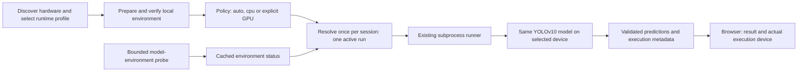

# RayGuard GPU inference: research and implementation plan

> Historical SDP record from 25–26 September 2026. Commands and service ports
> below describe that original checkout and its private evidence, not an
> automatically available preview or a new verification of this repository.
> Use the [current app setup](../README.md) for the extracted layout.

Study date: **26 September 2026**. Workstream: [T28](https://github.com/abdalrahman-ismaik/SDP-I-RayGuard/blob/main/docs/tasks.md), with baseline
evidence from [T04](https://github.com/abdalrahman-ismaik/SDP-I-RayGuard/blob/main/docs/first-inference.md). This document preserves the original
research and implementation protocol. The subsequent implementation and local
CPU/CUDA execution are recorded separately in [runtime verification](runtime-verification.md).
The original study itself did not install packages or run GPU inference.

The [implementation prompt](gpu-implementation-prompt.md) translates this plan into
phased engineering work and acceptance criteria; execution claims belong in the
verification record. External laptop and human acceptance remain outstanding.

## Recommendation and scope

Add **automatic hardware discovery and local runtime preparation**, with an **Auto**
execution policy for new installations and explicit CPU/GPU overrides. The user clarified
that this must work across supported laptops, not be tied to the inspected RTX 2060.
This supersedes the original explicit-only selection proposal: Auto chooses a qualified
GPU before a session, or reports why it chose the verified CPU runtime. It never silently
changes device halfway through a run. Existing configs without this new policy retain CPU.

Start with GPU FP32, batch one, the same checkpoint and original fork. PyTorch
**2.9.0+cu126** / torchvision **0.24.0+cu126** remains the RTX 2060 candidate, not a
universal laptop package. Preserve the working CPU environment and apply resolved
device/environment changes on a deliberate service restart.

This changes the inference device in the Python backend. The website connects to it;
opening RayGuard on another computer does not make the browser's GPU available to it.
The eye video and dashboard rendering are separate from model acceleration.

**Recorded direction:** M02/F02 require a simple existing-model GUI and showcase.
The user additionally requested this GPU feasibility study and plan, then automatic
compatibility checking and setup on other laptops. GPU acceleration
is a proposed enhancement, not a replacement for the outstanding lab-model pairing,
human rehearsal or scanner handoff. The 30 September poster obligation and unresolved
8/15 October prototype versus 15 October Batch 1 conflict remain in
[status](https://github.com/abdalrahman-ismaik/SDP-I-RayGuard/blob/main/docs/status.md). Human implementation/review owners remain TBD.

**First release excludes:** FP16/AMP, TensorRT, ONNX export, compilation, batching,
simultaneous multi-GPU execution, live device switching, remote GPU services and training. Those change
more than the execution device and require their own evidence. No speedup is promised.

## Evidence collected and its limits

| Evidence level | Observation | Consequence |
|---|---|---|
| Executed and verified: hardware query | RTX 2060, driver 591.74, 6,144 MiB VRAM, compute capability 7.5; WDDM | A CUDA candidate exists; available inference memory still needs measurement |
| Executed and verified: model interpreter probe | Python 3.11.9, torch 2.9.0+cpu, torchvision 0.24.0+cpu; CUDA build null, availability false, device count zero | The configured interpreter cannot currently execute CUDA |
| Artifact inspected: environment configuration | Existing `.venv-yolov10` inherits system packages | Preserve it; create the GPU environment without system-package inheritance |
| Executed and verified: artifact hash | Existing generic checkpoint still matches SHA-256 below | Compare the same model bytes; publisher byte identity remains unverified |
| Artifact inspected: application and installed fork | Script hardcodes CPU; configuration/runner have no compute-device setting; fork supports explicit CUDA | Installing CUDA packages alone will not enable RayGuard GPU inference |
| Executed and verified: resource snapshots | GPU memory in use was 1,881 MiB at one probe; C: free space was 20,898,840,576 bytes, about 19.46 GiB | These are transient setup observations, not capacity guarantees |
| Documented and remotely inspected | Official version instructions, Windows build scripts, wheel metadata/index entries and HTTP headers | Establish a credible package candidate, not a working local CUDA installation |
| Not executed | CUDA kernels, this checkpoint on GPU, parity, peak model VRAM and latency comparison | All remain acceptance gates |

Read-only commands included:

```powershell
nvidia-smi --query-gpu=name,driver_version,memory.total,memory.used,compute_cap --format=csv,noheader
.venv-yolov10/Scripts/python.exe -c 'import json, torch, torchvision; print(json.dumps({"torch":torch.__version__,"torchvision":torchvision.__version__,"cuda_build":torch.version.cuda,"cuda_available":torch.cuda.is_available(),"gpu_count":torch.cuda.device_count()}))'
Get-Content .venv-yolov10/pyvenv.cfg
Get-FileHash -Algorithm SHA256 -LiteralPath data/IEDXray/model-weights/yolov10_generic_exp.pt
Get-Volume -DriveLetter C
```

The `CUDA Version 13.1` banner from `nvidia-smi` describes driver capability; it does
not mean the configured CPU-only PyTorch contains CUDA 13.1.

## Runtime research

| Decision | Primary-source evidence and interpretation |
|---|---|
| RTX 2060 is a viable candidate | NVIDIA lists it as compute capability 7.5. The pinned PyTorch v2.9.0 Windows CUDA 12.6 build includes `7.5`, including torchvision `sm_75`. [NVIDIA GPU table](https://developer.nvidia.com/cuda/gpus), [Windows build definition](https://raw.githubusercontent.com/pytorch/pytorch/v2.9.0/.ci/pytorch/windows/cuda126.bat) |
| Keep current framework versions initially | PyTorch publishes the 2.9.0 / 0.24.0 pair for Windows with cu126. This minimizes the version change from the working CPU baseline; it is not a recommendation to upgrade to the latest release. [Official version instructions](https://pytorch.org/get-started/previous-versions/#v290) |
| Python 3.11 Windows wheels exist | The official indexes contain `torch-2.9.0+cu126-cp311-cp311-win_amd64.whl` and `torchvision-0.24.0+cu126-cp311-cp311-win_amd64.whl`; inspected metadata requires Python >=3.10 and torchvision's matching torch 2.9.0. [Torch index](https://download.pytorch.org/whl/cu126/torch/), [torchvision index](https://download.pytorch.org/whl/cu126/torchvision/) |
| Current driver is sufficient for this candidate | CUDA 12.6 Update 3 lists Windows driver 561.17; installed 591.74 is newer. No driver upgrade is indicated. This does not prove application compatibility. [NVIDIA release notes](https://docs.nvidia.com/cuda/archive/12.6.3/cuda-toolkit-release-notes/index.html) |
| No full CUDA Toolkit planned | Prebuilt PyTorch binaries supply their CUDA runtime dependencies. Building custom CUDA extensions requires additional compiler/toolkit tools; that build path is not needed for the proposed ordinary PyTorch model execution. [PyTorch maintainer explanation](https://discuss.pytorch.org/t/cuda-driver-cuda-toolkit-and-pytorch/198869), [extension requirements](https://docs.pytorch.org/docs/2.9/cpp_extension.html) |
| CUDA 13 is an alternative, not ruled out | CUDA 13 drops Maxwell/Pascal/Volta support, not Turing; PyTorch's v2.9.0 Windows cu130 build includes 7.5. cu126 is chosen to limit the first experiment, not because RTX 2060 cannot run cu130. [CUDA 13 release notes](https://docs.nvidia.com/cuda/archive/13.0.0/cuda-toolkit-release-notes/), [cu130 build definition](https://raw.githubusercontent.com/pytorch/pytorch/v2.9.0/.ci/pytorch/windows/cuda130.bat) |
| FP32 before reduced precision | Turing has FP16 Tensor Cores; potential speed and output differences require measurement. TF32 acceleration belongs to Ampere and later, so it is not an RTX 2060 optimization. [Turing guide](https://docs.nvidia.com/cuda/archive/13.0.0/turing-tuning-guide/index.html), [PyTorch precision controls](https://docs.pytorch.org/docs/2.9/notes/cuda.html#tensorfloat-32-tf32-on-ampere-and-later-devices) |
| Qualify actual available VRAM | WDDM shares the GPU with desktop applications; `nvidia-smi` per-process memory may be unavailable. An unavailable value is not zero usage. The checkpoint's file size does not predict peak inference memory. [NVIDIA-SMI documentation](https://docs.nvidia.com/deploy/nvidia-smi/) |

The pinned fork's [requirements.txt](https://raw.githubusercontent.com/THU-MIG/yolov10/453c6e38a51e9d1d5a2aa5fb7f1014a711913397/requirements.txt)
pins torch 2.0.1 / torchvision 0.15.2 alongside export/runtime packages that are
unnecessary for this proposed native-PyTorch path.
Its [package metadata](https://raw.githubusercontent.com/THU-MIG/yolov10/453c6e38a51e9d1d5a2aa5fb7f1014a711913397/pyproject.toml)
has broader minimums. The existing project already uses 2.9.0 successfully on CPU;
neither broad dependency bounds nor CPU success prove GPU compatibility. Do not
blindly install the upstream requirements or replace this fork with stock Ultralytics.

The inspected torch and torchvision wheel headers total **2,591,262,291 bytes**
(about 2.59 GB), before dependencies, unpacking and cache copies. Recheck disk space
and the complete resolver plan before installing. Do not automatically delete caches
or existing environments. The publisher-index SHA-256 values, not locally verified
download hashes, are:

```text
torch       94fc90845de9324943c2f4f5ebffca35df32135e562cd040c3b5cc17259bbc8a
torchvision 4a37023bbb2e67eaacf66a48e679284b21990eb63993fea078de42cdee15d554
```

## Laptop portability and automatic setup

**Product requirement:** on each supported backend host, discover its hardware, choose
a tested runtime profile, prepare an isolated environment, verify actual execution and
save machine-local settings. The default new-installation experience is **Auto**; users
should not have to select a CUDA version or edit another laptop's paths. Automatic
detection does not mean every GPU can execute this model. An unsupported GPU leaves
the supported CPU path available, with a clear reason. Missing weights or an unsupported
host OS/architecture still require setup; CPU fallback is not proof the app runs everywhere.

The first implemented acceleration target is **supported Windows x64 NVIDIA laptops**,
with multiple generations represented by reviewed profiles. Detection can identify
other vendors immediately; their GPU execution remains gated until a corresponding
adapter/profile passes real RayGuard checks. Linux and macOS need their own packaging
and launch validation; the existing PowerShell launcher is not evidence for them.

| Detected hardware / backend | Planned handling and evidence boundary |
|---|---|
| NVIDIA / CUDA | Match OS, CPU architecture, driver, GPU compute capability and wheel coverage to a qualified profile. cu126 covers the inspected RTX 2060 candidate; newer architectures can require cu128/cu130 or another separately qualified build. PyTorch's v2.9.0 [cu128 Windows build](https://raw.githubusercontent.com/pytorch/pytorch/v2.9.0/.ci/pytorch/windows/cuda128.bat) adds architectures absent from its cu126 build. Never select by the RTX name alone. |
| Intel / XPU | PyTorch 2.9 documents Arc and selected Core Ultra GPUs on specified Windows/Linux versions. XPU is not CUDA and does not cover every Intel integrated GPU. The old YOLO fork's selector needs an adapter audit before automatic activation. [PyTorch XPU hardware/software requirements](https://docs.pytorch.org/docs/2.9/notes/get_start_xpu.html) |
| AMD / ROCm | Match the exact GPU, OS, Python and framework to AMD's published matrix. Native Windows support exists for selected configurations, not every Radeon laptop. ROCm uses PyTorch's `torch.cuda` interface; distinguish `torch.version.hip` from NVIDIA's CUDA runtime. [AMD Windows matrix](https://rocm.docs.amd.com/projects/radeon-ryzen/en/latest/docs/compatibility/compatibilityrad/windows/windows_compatibility.html), [PyTorch HIP semantics](https://docs.pytorch.org/docs/2.9/notes/hip.html) |
| Apple / MPS | macOS has a distinct PyTorch MPS backend. Check build support and availability, then qualify the checkpoint, operations, timing and app packaging. MPS is a future profile, not a CUDA installation on Mac. [PyTorch MPS](https://docs.pytorch.org/docs/2.9/notes/mps.html) |
| DirectX 12 GPU / DirectML | Possible separate Windows path, but it has its own PyTorch package/operator constraints. It is not a drop-in addition to the current 2.9.0 fork environment; qualify separately if needed. [Microsoft setup](https://learn.microsoft.com/en-us/windows/ai/directml/pytorch-windows) |
| Missing, disabled, incompatible or unqualified GPU | Use a verified CPU profile in Auto; show the reason. An explicit GPU override fails clearly instead of silently becoming CPU. |

The installed original fork recognizes CUDA and MPS strings, but this is only inspected
selection code, not proof this model runs on MPS. It does not provide equivalent string
routing for XPU or DirectML. A backend availability flag never bypasses model validation.
AMD's examined Windows matrix does not substantiate this plan's FP32-only model path;
retain that as an explicit qualification question. For NVIDIA, an exact `sm_XX` list
match is not a universal requirement: compatible cubins/PTX can cover additional devices.
Use reviewed binary compatibility plus actual kernel/model execution.
[NVIDIA compatibility rules](https://docs.nvidia.com/cuda/archive/13.0.0/ampere-compatibility-guide/index.html)

### First launch versus ordinary startup

1. **Inventory without depending on an installed GPU PyTorch.** Read OS/architecture,
   Python, disk space, GPU vendor/model/identity and driver. On Windows, use bounded OS
   adapter enumeration plus `nvidia-smi` when available; missing `nvidia-smi` is not proof
   that no GPU exists. Do not use the current CPU-only interpreter's CUDA result as the
   sole hardware detector. Hardware discovery runs on the machine hosting the API.
2. **Select a reviewed profile.** A small versioned profile table binds hardware/OS
   requirements to an exact Python/runtime lock, trusted package sources, backend
   adapter version and qualification evidence. Unknown combinations stay unqualified;
   never search the internet for arbitrary packages or upgrade to the latest wheel at
   runtime. Include a reproducible isolated CPU profile so a new laptop does not need
   this workstation's inherited global packages.
3. **Prepare once through first-run setup.** Automatically install the selected
   allowlisted runtime into an app-owned environment, with download-size/progress,
   disk/network checks and cancellation. Package setup is separate from `/api/health`
   and page loads. Cancelled/offline/failed setup preserves a working CPU environment,
   or reports incomplete setup if none exists. Do not upgrade drivers, install a system
   toolkit or alter global Python; give a specific driver action if required. Authorized
   model artifacts are located and hash-checked separately, not silently downloaded.
4. **Verify before activation.** Run the bounded environment/kernel checks and a small
   batch-one model qualification using the local authorized checkpoint and diagnostic
   input. Release/profile qualification uses the full controlled comparison below;
   a fresh laptop compares its prepared CPU/GPU runtimes on an authorized local image
   using the same correspondence/tolerance criteria. It does not require this workstation's
   inherited environment, pre-change outputs or three private diagnostic files.
   If no authorized input is present, report model verification pending; do not invent
   one or label the GPU model ready. The UI may open with this prepared, unverified
   runtime: Source setup offers **Verify with this scan** after an authorized image is
   uploaded. A bounded qualification job on the same serial executor checks CPU first,
   then GPU, retaining private diagnostic evidence. This setup action is permitted
   while normal inference/replay/intake remain blocked; success enables ordinary runs.
   Under Auto, GPU failure may resolve to verified CPU; explicit GPU remains unavailable
   until qualification passes or the user deliberately selects CPU. CPU-only setup
   verifies CPU alone without requiring GPU comparison. These runs verify execution,
   not accuracy. Ship no private scans as installation fixtures.
5. **Save a local resolution.** Keep the requested policy, selected profile/interpreter,
   actual device identity, checkpoint/fork/lock hashes and verification results in ignored
   local configuration/state. Activate atomically only after checks pass. Reuse verified
   environments on later launches; failed setup never overwrites the last working profile.
6. **Recheck on later starts.** Use cheap inventory/runtime checks and cached model
   qualification. Invalidate qualification after relevant GPU/driver/OS/runtime/model/
   adapter changes or a copied/moved installation with invalid paths. A driver update
   can require revalidation without reinstalling packages. Never carry another laptop's
   environment paths, GPU index or successful qualification stamp as portable evidence.

This is a setup lifecycle around the existing runner, not a new package manager or
inference scheduler. During ordinary launches the existing service is preserved;
preparing a new environment does not hot-swap an active session. Installation progress
belongs in the launcher/setup flow, with a summarized state and next action in Source.

### Auto policy, hybrid laptops and fallback

New setup writes `inference_device: auto`; existing missing-field configs retain `cpu`.
Explicit `cpu` and `cuda:N` remain available. Resolve Auto to one explicit device and
interpreter for the session and snapshot them per accepted run. A small policy table
decides admission:

| Requested policy | Startup result |
|---|---|
| Auto, qualified GPU available | Select the verified GPU profile; show its actual name |
| Auto, GPU unavailable/unqualified/setup failed | Use the verified CPU profile and display the reason; retain the GPU setup action |
| Explicit CPU | Use verified CPU, with no GPU setup needed |
| Explicit GPU missing or failing qualification | Show actionable failure; do not substitute CPU |

Enumerate all visible adapters: an Intel display GPU must not hide an NVIDIA compute
GPU on a hybrid laptop. Respect user visibility restrictions; among compatible verified
GPUs use a deterministic order (saved available preference, then descending total VRAM,
then stable identity). Recheck current free memory and run the qualification probe;
this ordering does not claim to select the fastest GPU. Never infer physical identity
from adapter list position or treat shared system memory as dedicated VRAM.

Define `cuda:N` relative to devices visible in the selected model environment. The fork
rewrites `CUDA_VISIBLE_DEVICES` when passed a string, potentially overriding inherited
restrictions and remapping indices. Resolve and validate inside the child process,
preserve the visibility mask, and pass a validated `torch.device` to its supported
short-circuit path. Record actual logical index plus stable UUID/PCI identity where
available; recheck identity before execution. Do not copy indices between hosts.

Fallback is automatic **before accepting a session's runs**, with a displayed reason.
A GPU that fails during a run produces a failed record and pauses automatic acquisition;
it does not silently retry on CPU or relabel a partial result. Offer explicit CPU
recovery for subsequent work using the restart procedure below. CPU availability also
requires a verified runtime and the authorized model pairing. Show distinct states such
as **Checking hardware**, **Preparing runtime**, **Model check pending**,
**GPU ready: device name**, and **CPU active: reason**; never claim speed from detection.

## Preserve the baseline

| Item | Frozen value / behavior |
|---|---|
| Checkpoint | `yolov10_generic_exp.pt`, 33,482,415 bytes; SHA-256 `b484d9a6fb37236f6adcc8c019e6a836f11901dc53a0f71d6cce7262413287ff` |
| Backend | THU-MIG YOLOv10 revision `453c6e38a51e9d1d5a2aa5fb7f1014a711913397`; package version 8.1.34 alone is insufficient identity |
| Model / category | Generic YOLOv10-M; model index `0: Explosive`; namespace `iedxray.generic_explosive_detection` |
| Prediction settings | Batch 1, FP32, confidence 0.25 for qualification, `imgsz=640`, `max_det=300`, no augmentation; original one-to-one/top-k output without NMS |
| Preprocessing | GUI EXIF orientation, RGB canonical PNG, then original automatic stride-aligned letterboxing and RGB / 255 |
| Coordinates | `box_xyxy` in original canonical-image pixels; never normalized or network-input coordinates |
| Interpretation | Empty predictions remain no detections above threshold, never a benign verdict; model failure remains a failed run |
| Checkpoint loading | Keep the exact hash and fork checks, and the existing narrowly scoped full-object load override for that inspected file only |

## Proposed design and exact change points



| File / boundary | Planned change |
|---|---|
| `environments/` (new, proposed) | Reviewed runtime-profile table, isolated CPU lock, and `yolov10-cu126/` candidate lock/setup notes. Add other GPU/platform locks only after separate qualification. Keep root/API locks free of Torch; record sources, wheel hashes and fork archive identity. |
| `scripts/setup_model_runtime.py` (new, proposed); `run-app.ps1` | Small platform-aware setup entry point for inventory, profile choice, managed environment preparation and atomic local activation. Windows launcher calls it for first-run setup; repeated launches preserve the existing service. No package installation inside the API. |
| `app/config.example.json`; `backend/src/rayguard_gui/config.py` | Add validated policy `auto` / `cpu` / `cuda:N`; newly generated configs use Auto, absent legacy field remains CPU. Preserve `model_python` as an advanced override, never overwrite its environment; managed setup writes local paths only. Resolve selected interpreter/device/profile into an immutable session record. |
| `scripts/infer_generic_yolov10.py` | Accept resolved `--device cpu` or `cuda:N`, preserving visibility through a validated `torch.device`; no unresolved Auto passed into the fork. Retain `half=False`, output/run binding, baseline checks, actual metadata and safe classified failures. |
| `scripts/probe_model_runtime.py` (new, proposed) | Bounded, model-free environment check in the configured model interpreter; versioned, size-limited JSON. No dependency downloads or checkpoint loading. |
| `backend/src/rayguard_gui/runner.py` | Forward device through fixed argv; provide bounded probe execution; validate a small execution record from the private manifest and safe failure codes. Preserve shell-free execution and timeout. |
| `backend/src/rayguard_gui/api.py` | Expose policy, selected backend/device/profile, reason and cached check state; add optional validated outer `Run.execution`; block jobs while selection is unresolved or selected runtime is invalid; retain one active job and release on terminal failure. |
| `backend/src/rayguard_gui/intake.py`; `demo.py` | Pause automatic acquisition on persistent compute failures; preserve remaining queue and failed replay index. Ordinary per-image failures keep their existing recovery behavior. |
| `frontend/src/types.ts`; `frontend/src/components/InputPanel.tsx`, `FindingsPanel.tsx`, `ScanCanvas.tsx` | Show configured CPU/GPU and environment-check state; put actual completed-run execution evidence in FindingsPanel; replace CPU-only waiting text. Coordinate placement with the concurrent dashboard owner. |
| `frontend/src/hooks/useWorkspace.ts`; `frontend/src/App.tsx`; `frontend/src/components/DatasetDemo.tsx`, `IntakeBar.tsx` | Consume shared readiness for manual run, replay and intake controls; keep the API as the authoritative admission check. Audit Dashboard/MainMenu status wording too. |
| Root/backend tests; focused browser tests | Verify configuration, command routing, provenance, errors, queue preservation, older records and CPU regression without requiring GPU packages in CPU CI. |
| `app/README.md`; shared progress/status/task record | Document automatic first-run setup, supported combinations, CPU fallback, manual override, restart, recovery and evidence limits. Distinguish proposed model setup from the launcher's current web/API-only behavior. |

All `backend/` and `frontend/` paths in this table are relative to `app/`; adjacent
component filenames share the preceding `frontend/src/components/` directory.
The environment directory is proposed outside `models/`, whose contents are ignored
except its README. Actual environments, local configs and outputs stay ignored.

### Device selection and environment status

Keep the resolved interpreter/device immutable during a session. Auto may select CPU
at startup with a recorded reason; an explicit GPU request either executes on that
verified GPU or returns a clear failure. No per-run silent fallback. Existing manual
interpreter overrides are checked, not replaced or repaired implicitly; show a managed
setup option if that interpreter cannot meet the selected policy.

The setup probe uses a separate short-lived subprocess, a proposed 30-second timeout,
no shell and a small validated output. Cache interpreter/config identity and check
time; `/api/health` reads that record, never imports Torch or probes every poll.
Schedule the GPU probe on the existing session executor after establishing its cached
checking state; do not block the API startup/event loop. While selection is unresolved,
inference submission is disabled; failure leaves the service usable for viewing/export
and Auto can resolve to a separately verified CPU runtime before accepting jobs. Enforce readiness
centrally in `Session.start_run` and reject acquisition Start before consuming pending
items. Legacy explicit CPU startup keeps its existing behavior without requiring a CUDA
check; newly prepared CPU profiles still need model verification before being labelled
verified. Cleanly
join/terminate the bounded probe on shutdown. Restart refreshes it in the first release.

Distinguish **configured**, **environment checked**, and **model execution verified**.
A CUDA availability result does not establish sufficient memory or a successful model
forward. Preserve the inherited visibility mask and use the validated-device path
described above; probe and inference processes must agree on the effective device map.
Record the resolved logical index and GPU identity after selection.

For the RTX 2060 candidate environment, pin Python 3.11.9, the selected torch/vision wheels,
the original fork URL and all resolved dependencies. Start dependency review from the
existing freeze; explicitly resolve inherited packages into the new isolated environment.
The observed core set includes numpy 2.2.6, OpenCV 4.12.0.88, Pillow 12.0.0 and
SciPy 1.16.3. These observations are not a complete lock. Validate imports, dependency
consistency and a clean recreation before calling setup reproducible. No global
package, driver or toolkit change is planned.

### Execution provenance and failures

Keep the strict shared `ScanResult` / `predictions.json` schema unchanged. Its exact
key validation rejects arbitrary hardware fields, and detection `device_id` means an
electronic-device association, not a GPU. Raw manifests contain private paths and must
never be exposed wholesale through the API.

Extend the private manifest with requested policy, selected profile/backend and selection
reason, resolved and actual device, actual model/input dtype,
torch runtime version including `+cpu`/`+cu126`, torchvision/CUDA/cuDNN versions, GPU
name/capability, driver where available, precision settings, forward shapes, memory
and clearly bounded timings. Keep hashes, threshold, task and source provenance.
Before device resolution, actual device is unknown, not the requested value.

For the GUI, use an optional outer `Run.execution` with its own schema version and
an allowlisted subset: policy, selected profile/backend, selection reason,
requested/actual device, GPU name, precision and runtime
versions. Validate it against the run and manifest; do not trust a configuration label
as execution evidence. Bind the manifest to the canonical-input hash, prediction-file
hash and existing checkpoint/run identities. Have the runner return a small internal
object containing the prediction and separate execution record; `Session.perform`
validates the prediction as before and attaches the validated record outside it.
Update injected test runners to that internal return type. Preserve the existing GUI export envelope version for this
additive optional field, with tests for old/new exports. Older missing execution
metadata renders as **Not recorded**. Evidence-schema changes inside predictions
would instead require a separate contract decision.

Preserve the concurrently added read-only annotation comparison (`comparison.py`,
`demo_annotations`, comparison endpoint and `annotation_comparison` export field).
Its annotation matching at IoU 0.50 is separate from CPU/GPU numerical parity below;
reference annotations must not enter model prediction or device selection.

Classify known CUDA-unavailable, incompatible-runtime and out-of-memory failures in
structured private output. Read only bounded, allowlisted fields; keep raw exceptions
in private logs. If startup fails before a structured record exists, retain a generic
safe failure. No regex classification of arbitrary stderr. Every failure leaves
`result=null`, records its cause and releases the active worker; never substitute an
empty successful prediction. Do not silently retry on CPU, lower image size, change
threshold or use half precision.

**Queue issue to fix:** current folder intake proceeds to the next pending scan after
any failure. A persistent CUDA problem could consume the whole queue as failed runs.
Pause intake on classified compute failures and GPU timeouts, preserve pending scans,
and expose a deliberate retry/resume path. Keep the failed scan identifiable for retry.
Replay already stops on failure and retains its failed index; preserve that behavior.
The per-service one-worker limit is not a machine-wide GPU lock: nominate one GPU
inference service/output owner during qualification.

## Implementation sequence and acceptance gates

These are implementation gates under T28, not a second task backlog. One coordinator
owns dependencies, shared status and GPU output directories. Independent reviewers
check label/split/claim correctness and failure behavior; student ownership is not inferred.

| Step | Deliverable | Exit evidence |
|---|---|---|
| 1. Freeze and prepare | Save current CPU config/freeze/hashes and old runner; capture CPU predictions on the fixed canonical PNGs before edits; prepare profile table, isolated CPU/CUDA recipes and first-run setup; budget disk/downloads | Independent pre-change CPU control; reviewed sources; fresh environments have no inherited system packages; selection/install/recovery software checks |
| 2. Qualify environment | Install the isolated candidate when implementation begins; inspect architecture coverage and execute a tiny CUDA operation | Exact versions, CUDA/cuDNN, capability, compatible kernel coverage and synchronized operation success; relevant torchvision import/operator smoke also checked |
| 3. Implement CLI device path | Explicit device argument, unchanged FP32 task, real forward metadata and classified errors | CPU regression against the pre-change control, one genuine positive CUDA forward, then full three-case A/B/C parity below |
| 4. Integrate service and UI | Config routing, cached probe, optional execution record, queue pause/retry, neutral/device-aware text | Synthetic API/browser regressions plus real upload, finite replay and folder lifecycle checks |
| 5. Measure | Bounded process-cold benchmark below, after correctness and integration checks | Saved prediction/overlay/manifest inspection, actual peak memory and latency samples |
| 6. Rehearse and qualify portability | Auto setup on clean supported hosts, explicit GPU/CPU overrides, presentation walkthrough and rollback | Correct selections on actual second NVIDIA laptop and CPU host, genuine model evidence, no copied paths; failure recovery/rollback demonstrated. Until then, no cross-laptop usability claim |

If environment or parity gates fail, keep the CPU app working and investigate the
specific incompatibility. Do not move immediately to another runtime/export/model.
Backend and UI edits can proceed in separately owned files; all actual GPU jobs remain serial.
Synthetic service/UI work may proceed earlier, but real GPU replay/intake qualification
waits for the complete diagnostic parity gate.

### Correctness comparison

For development/release qualification, use identical saved canonical PNG bytes,
checkpoint, settings and runner revision:

| Target | Purpose |
|---|---|
| A: existing environment, new runner, CPU | Compare against saved pre-change runner outputs on the same canonical PNGs |
| B: isolated CUDA environment, CPU | Expose environment/build differences before attributing them to GPU |
| C: same isolated environment, CUDA | Isolate the selected compute-device behavior relative to B |

Use the three established diagnostic sources: `Train000003.jpg` (known positive),
`Test000001.jpg` (annotated missed threat), and `Test000034.jpg` (empty output).
Record original and canonical hashes, dimensions and final prediction tensor shape.
First establish A on canonical inputs; historical direct JPEG outputs are not byte-for-byte
GUI preprocessing controls. Preserve the pre-change canonical CPU control independently;
an error shared by A/B/C must not count as regression safety. Repeat the positive on each target.

Freeze these **proposed engineering tolerances before looking at GPU results**:
exact count/class/namespace/dimensions/threshold; corresponding boxes have maximum
absolute coordinate difference <=0.5 original-image pixel, IoU >=0.99, and confidence
difference <=0.001. Match boxes one-to-one by class and overlap, not output order.
Any missing/added detection, threshold crossing, non-finite value or failed tolerance
blocks automatic acceptance and requires inspection. These are compatibility gates,
not accuracy metrics or universal numerical guarantees. PyTorch does not guarantee
bitwise CPU/GPU agreement. [Numerical accuracy](https://docs.pytorch.org/docs/2.9/notes/numerical_accuracy.html)

Keep FP32, no AMP and record effective precision/determinism settings. Since portable
NVIDIA support includes newer GPUs, explicitly set IEEE FP32 for applicable matrix
multiplication/cuDNN paths using the pinned Torch API, without mixing old/new controls.
Do not change this policy automatically by GPU generation. Seeds alone do
not guarantee reproducibility. [PyTorch reproducibility](https://docs.pytorch.org/docs/2.9/notes/randomness.html)
Preserve published splits and the known miss; do not adjust thresholds or tolerances
to make test cases pass. The training image is diagnostic, not unseen evaluation.
Three cases do not establish accuracy, generalization or safety.

### Performance and memory study

The current service creates a Python process and reloads the model per scan. The
installed fork warms up GPU with a dummy forward, normally 1x3x640x640, but skips CPU
warm-up. That setup repeats for every GPU scan. The actual scan can have a rectangular
tensor. Qualify memory for both warm-up and the largest intended input shape.

| Measurement | Boundary / interpretation |
|---|---|
| `load_seconds` | Existing model-constructor time; device transfer/backend setup may occur later |
| `predict_call_seconds` | Defined wrapper boundary around prediction; document whether warm-up/preprocessing/postprocessing are included and synchronize any custom CUDA timing |
| Upstream stage timings | Existing pinned `ops.Profile` already synchronizes CUDA; its preprocess/inference/postprocess values are diagnostic substages |
| Full child-process time | Parent stopwatch around process start to exit, including imports, load, device setup, warm-up, prediction, extraction and output writes |
| Existing API `elapsed_seconds` | Includes worker execution/validation, but excludes upload, queue/browser delay and final `save_run` persistence |
| Request-to-visible-result | Separate real browser/API measure; state upload/normalization inclusion and polling delay |

CUDA is asynchronous; custom timers need synchronization or appropriately scoped
CUDA events. Record peak allocated/reserved memory and free/total memory; allocator
metrics exclude some driver/desktop usage. [PyTorch CUDA semantics](https://docs.pytorch.org/docs/2.9/notes/cuda.html)
The architecture check is available through
[`get_arch_list`](https://docs.pytorch.org/docs/2.9/generated/torch.cuda.get_arch_list.html);
it complements, rather than replaces, actual execution.

After correctness passes, predeclare **five fresh-process repetitions per diagnostic
image per target A/B/C: 45 runs total**. Alternate target/order; retain ordinary warm-up
cost. Record every sample, per-image median and range, memory, power state, CPU threads
and competing GPU activity. This is a bounded process-cold comparison, not machine-cold
testing or a defensible p95/FPS claim. Stop on failure; use fresh private output directories.
Replay's default three-second wait after each run is deliberate pacing, not inference time.

Adoption requires correct/recoverable results and a demonstrated application benefit;
no numerical speed target has yet been supplied. If startup dominates, consider a
persistent model worker as a later, separately reviewed change. It needs model lifetime,
crash recovery, memory release and shutdown work. Do not present warmed-loop figures
as current GUI performance.

### Software checks, recovery and rollback

Required implementation checks (future commands; not run for this documentation study):

```powershell
uv run --locked ruff check .
uv run --locked python -m pytest
uv run --project app/backend --locked python -m pytest
npm --prefix app/frontend run build
npm --prefix app/frontend run test:e2e
```

Cover default/invalid device settings; exact argv; cheap health polling; failed/pending
probe state; successful actual-device provenance; malformed/stale outputs; unavailable
CUDA/OOM/timeout; worker release; queue preservation/resume; demo failed cursor;
review/held-scan behavior; old exports with absent execution metadata; CPU rollback.
Add synthetic inventory/profile cases for no GPU, hybrid graphics, multiple visible
GPUs, visibility masks, older/newer architectures, missing/outdated driver, unsupported
vendor/OS, unavailable runtime, offline/cancelled setup, insufficient disk, invalid
download hash, interrupted activation, stale identity and old manual configs. Check
Windows `Scripts/python.exe` versus Unix `bin/python` path handling when those platforms
are enabled. Real qualification is required on each supported backend/profile; synthetic
selection tests and the single RTX 2060 inspection cannot establish laptop portability.
Preserve the independent annotation comparison and its export/overlay behavior.
Use synthetic failures rather than deliberately exhausting VRAM or changing driver
settings. CPU CI remains GPU-free; it cannot establish real CUDA execution.

For rollback, pause acquisition and let any current run finish. Export needed reviews
and record pending source work. Stop only the intended service, restore the preserved
CPU interpreter and `inference_device: cpu`, restart, and rerun the known positive.
The launcher reuses an existing server, so editing config alone does not switch it.
Restart clears in-memory history/queues; saved disk evidence remains. First folder Start
baselines existing files, so recover pending files deliberately through upload or a
documented re-intake path. Preserve prior outputs and the original CPU environment.

## Unresolved questions and next action

- Exact lab laptop/pager or distributed-model pairing is still unconfirmed. This plan
  qualifies only the current generic detector; other models need separate environments,
  category/coordinate checks, memory qualification and real inference evidence.
- Peak VRAM, dependency resolution, CPU/GPU parity and visible latency remain unknown.
  The hardware/source evidence supports trying the pinned candidate, not skipping gates.
- Human implementation/review owners and an acceptable presentation latency target
  remain unassigned. Live UI switching is deferred unless an operational need emerges.
- Other laptop hardware and actual test access are not yet inventoried. Windows x64
  NVIDIA is the initial GPU target; AMD/XPU/MPS/DirectML and other OS profiles require
  their own release gates. Detection will explain unsupported combinations, not promise
  universal acceleration.
- Next implementation action: prepare and review the portable CPU/GPU profile locks,
  discovery/setup lifecycle and minimal CLI/config change, then execute serial qualification. Keep showcase
  obligations and the working CPU route available throughout.
